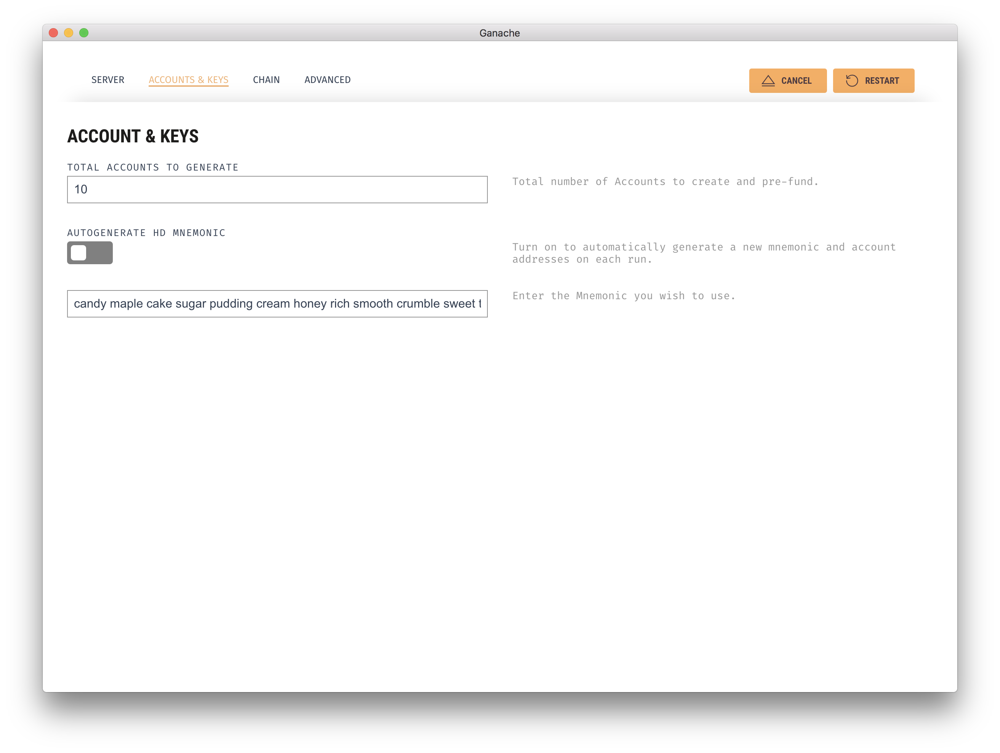
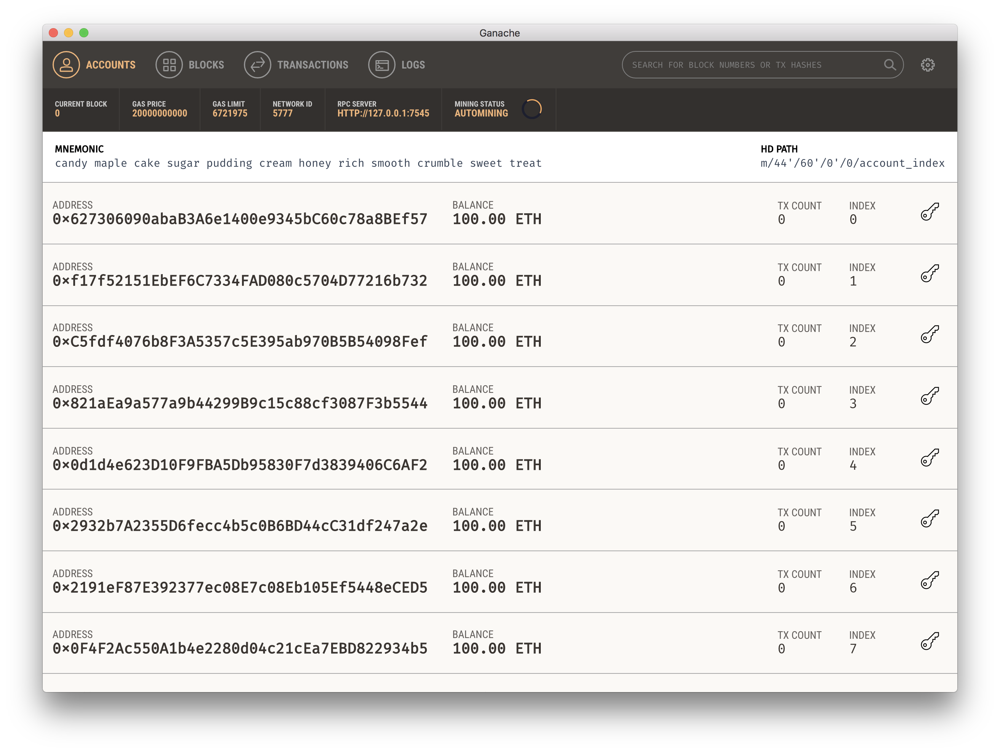
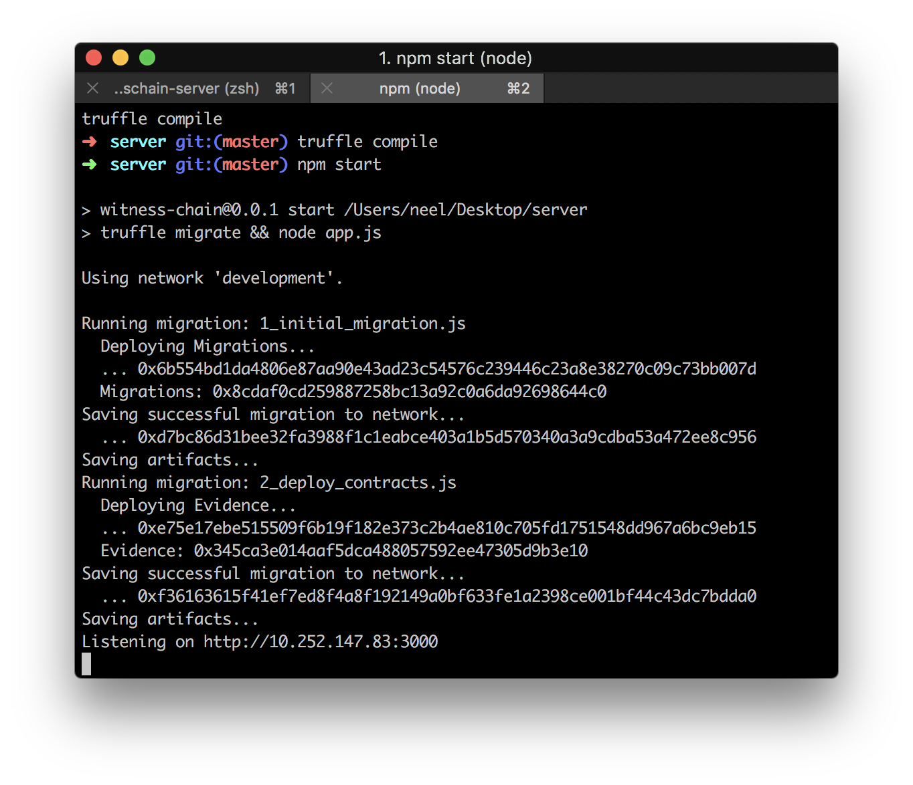

# WitnessChain

## Quickstart

* Download and install Ganache from `https://github.com/trufflesuite/ganache/releases`.

Then run:

```
git clone https://github.com/witnesschain/server
cd server
npm install -g truffle
npm install
truffle compile
```

Then double-click to open the Ganache app. In the settings, set the mnemonic to:

```
candy maple cake sugar pudding cream honey rich smooth crumble sweet treat
```



Be sure there's no space at the end! Then hit Restart and look at the Ethereum addresses that have been generated. It should look like this:




Your first address should be:

```
0x627306090abaB3A6e1400e9345bC60c78a8BEf57
```

Now, run `npm start` in one terminal tab. Leave that running. In another tab, do:

```
truffle test
npm test
```

`truffle test` is a bit finicky, so if it fails once, just try it again.

To start using the API, you'll need to find the IP address that the server is running on. See the last line of the terminal output, like so:



To interact with the API, you can use curl like so:

```
curl -XGET 'http://10.252.147.83:3000/hello'
```

Be sure to change the IP address accordingly, based on what you found earlier! The above curl command should return `Hello!`.

For other ways to use the API, see below.

## Restarting the server

Any time you change the server code and want to restart, do `npm quickstart`.

## Testing

Before you test, ensure the server is running: open the Ganache app and then run `npm start`. In another tab, you can then run `npm test` to test the server and API, and `npm run truffletest` to test just the contract.

Sometimes, when testing, some accounts may run out of money. That's fine - just restart Ganache from the Settings menu and try testing again.

## API Documentation

### `POST /new`
Creates a new address.

Parameters (in request body):

* `clear_images : String[]` - unique IDs for up to 4 full-quality images (max 32 characters each). This may need to be a timestamp or something instead of the full URL, since this string can be no more than 32 characters. These clear images will only be shown to police stations (receivers) who purchase the evidence.
* `blurred_images : String[]` - like above, unique IDs for up to 4 blurred images (max 32 characters each). Blurred images will be public, so identifying information should be blurred out.
* `latitude : Integer` - use 6 decimal places, so that latitude `42.5` is represented as `42500000`
* `longitude : Integer` - same caveat as above
* `price : String` - a number in wei. It may be too big to store as an integer in JavaScript, so you should put the price in a string.
* `description : String` - no more than 32 characters long
* `creator_address : String` - a 40-character Ethereum address for the person who took the photos. Also include the `0x` at the front, making it 42 characters.
* `receiver_address : String` - a 40-character Ethereum address for the police station to receive the photos. Also include the `0x` at the front, making it 42 characters.
* `violation_type : Integer` - unused for now, just use `1`

Returns:

* `success : Boolean`
* `address : String` - the address of the newly-created contract. Also includes the `0x` at the front, making it 42 characters.


### `POST /preview`

Shows the best available images of the given evidence contract. If the receiver hasn't bought the evidence yet, they'll see blurred images. If they have bought the evidence, they'll see clear images.

Parameters:

* `contract_address : String` - the address of the desired contract, from `/new`. Also include the `0x` at the front, making it 42 characters.
* `receiver_address : String` - the address of the police station that is previewing the evidence file (includes `0x`)

Returns:

* `images : String[]` - an array of string IDs. You can rehydrate these into the full image URLs on the client-side.


### `POST /purchase`

The police station buys this contract.

Parameters:

* `receiver_address : String` - the address of the police station that is buying the evidence file (includes `0x`)
* `contract_address : String` - the address of the desired contract, from `/new`. Also include the `0x` at the front, making it 42 characters.
* `money_amount : String/Number` - how much money, in `money_unit` units, the police station is offering. If you send too much money, you will be refunded anything above the price of the contract.
* `money_unit : String` - one of `wei`, `finney`, `szabo`, or `ether`.

Returns:

* `success: Boolean` - whether or not the purchasing worked. Sufficient funds must be passed and only the intended recipient can purchase.


### `GET /public_data`

Returns all public data about a contract, given its address.

Parameters (in query/URL string):

* `contract_address : String` - the address of the desired contract, from `/new`. Also include the `0x` at the front, making it 42 characters.

Returns:

* creator
* receiver
* latitude
* longitude
* `timestamp : Integer` - Unix timestamp of creation (seconds since the Unix epoch in 1970)
* description
* violation_type
* price
* `blurred_images : String[]`
* `bought : Boolean`
* `previewed : Boolean`


### `GET /list_contracts`

Gives a full list of all contracts, including most public information about them.

Parameters: None.

Returns: an array of all contracts, each including information similar to what's returned by `public_data` - besides `bought` and `previewed` since those are not constant.


### `POST /address`

Randomly generates an Ethereum address and private key from a given password.

Parameters:

* `password : String` - a strong password that will be used to generate this address. Can be any length.

Returns a JSON object containing:

* `privateKey : String` - the generated private key, encoded in base 16. There's no `0x` here.
* `keyObject`, which looks like [what you see in `var keyObject` here](https://github.com/ethereumjs/keythereum#key-export)

You can find the address, initialization vector, and salt in the `keyObject`.


## Random links


Start with this: http://truffleframework.com/tutorials/pet-shop

Pet-shop repo: https://github.com/truffle-box/pet-shop-box

This is ok but not that great: https://medium.com/etherereum-salon/hello-ethereum-solan-contract-4643118a6119

Use this IDE: https://github.com/ethereum/remix-ide

Test out contracts here: https://www.myetherwallet.com/#contracts

Solidity tips: https://ethereumbuilders.gitbooks.io/guide/content/en/solidity_tutorials.html

IPFS stuff: https://medium.com/@didil/off-chain-data-storage-ethereum-ipfs-570e030432cf

To make a Node.js server: https://ethereum.stackexchange.com/questions/24684/truffle-and-node-js
Example: https://github.com/gjeanmart/stackexchange/tree/master/24684-truffle-and-node-js

For production purposes, may need Geth instead of Ganache: https://hackernoon.com/ethereum-development-walkthrough-part-2-truffle-ganache-geth-and-mist-8d6320e12269
